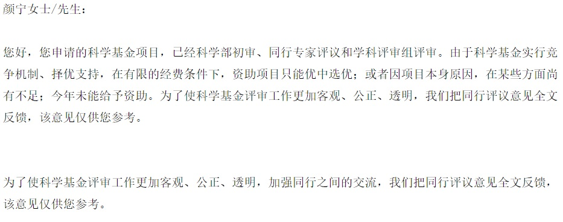

今天听其他学院的老师说学院规定教师信息中不能写本科学校，否则会被警告！这是什么鬼？本科母校比研究生母校低人一等？难道所有教师的本科学校都见不得吗？一个连本科母校都就不愿意提的难道不是忘恩负义之辈吗？ 为什么美国教授的简历都包括本科、研究生、博士生母校的完整受教育经历呢？一个连本科母校都被歧视的高校谈什么建设高水平研究性大学？谈什么教书育人？

发表5篇Science论文的清华著名美女教授颜宁虽然因“质量拼不过数量”被逼回到母校普林斯顿做全职教授，。好歹也放弃在美国工作机会回本科母校报恩了几年，为清华挣得了很大的荣誉。何况我等无名之辈，更没有以本科母校为耻的理由和资本啊？

这么牛的人都申请不到基金，何况我等呢？申请了15年申请不到，也就死心了，自从不申请基金项目后，感觉轻松多了！陈佩斯被央视禁止，也没有因此就不活了吗。无欲则刚，当你不再苦苦追求必然得不到的，也就不再痛苦了！